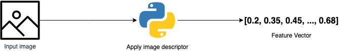
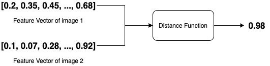

# IMAGE SEARCH ENGINE

## INTRODUCTION

content-based image retrieval,  is a system for retrieving similar images based on a given image. 
<br/>
We can use the given image to extract features and use those features to retrieve similar images. 


## PROJECT DESCRIPTION

There are 4 steps for building a simple image search engine:<br/>
- **Image descriptor**: For this, we need to decide what aspect of the image we want to describe. We are interested in the color distribution of the image.
- **Indexing the dataset**: Now we need to apply the image descriptor to each image in our dataset, extract features from these images, and write the features to storage.
- **Similarity metric**: For comparing features, we will be using chi-squared distance.
- **Searching**: Given a query image to your system, we will extract features from this query image and then apply our similarity function to compare the query features to the features already indexed. From there, we return the most relevant results according to your similarity function.




## PROJECT STRUCTURE

For this project, we used pictures of various vacation trips from all over the world from [`INRIA Holidays Dataset`](http://lear.inrialpes.fr/people/jegou/data.php)

There are two parts for this project:<br/>
**Server Side**<br/>
`app.py` will launch the Flask server.<br/>
`color_descriptor.py` is our color descriptor which uses a simple color histogram.<br/>
`index_multi.py` will use multiprocessing to index the features of the images in a .csv file.<br/>
`searcher.py` will get the image from the client side and perform the search.<br/>

**Client Side**<br/>
`App.js` is the main React component where everything connects.<br/>
`FileInput.js` is the React component responsible for getting the file from browser to the server & get the result back.<br/>

## HOW TO RUN
Go to the client folder
```shell
$ cd client
```
Install required packages and start the server
```shell
$ npm install && npm start
```
Go to the server folder
```shell
$ cd ../server
```
Install python packages & start the server
```shell
$ pip install -r requirements.txt && python app.py 
```
